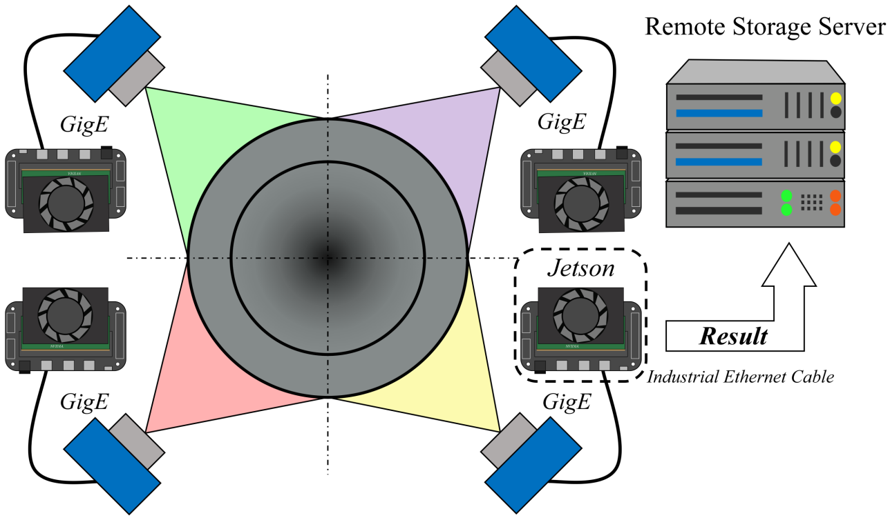

# A-Anti-Interference-Real-time-Segmentation-Network

This repository contains the official PyTorch implementation and the **MSD-SII** dataset for the paper:
> **An Edge-Based Online Mandrel Surface Defect Inspection System under Strong Industrial Interference**

## 🌟 Overview
This repository provides the code and dataset for automated mandrel surface defect inspection. At its core lies the Anti-Interference Real-time Segmentation Network (**AIRSegNet**), tailored to rob[...]

Deployed on Jetson edge nodes, AIRSegNet achieves an inference speed of **371 FPS**, meeting real-time inspection demands, and attains a mean Intersection over Union (IoU) of **0.57** with an ultra[...]

## 🏗️ Framework
The overall architecture of the proposed AIRSegNet is shown below:


## 🖼️ 芯棒表面缺陷检测系统


To address the aforementioned challenges, this study develops an automated detection and evaluation system for mandrel surface defects.

## 📷 环形相机进行360°扫描

本图展示了用于在线检测的成像与采集端设计。为保证稳定、高质量的采集结果，系统采用了均匀蓝光照明子系统、同步多相机线扫描成像以及分布式相机。

## 📊 MSD-SII Dataset & Preparation
We are releasing the **Mandrel Surface Defect under Strong Industrial Interference (MSD-SII)** benchmark, the first industrial mandrel defect dataset collected under strong interference conditions[...[...]
* **Complexity:** Includes severe defect-like interferences (e.g., water droplets, graphite contamination, oxide scale) to reflect real-world manufacturing challenges.

🔗 **Dataset Download Link:** [Insert your dataset link here, e.g., BaiduNetdisk / Google Drive]

### Directory Structure
After downloading the dataset, please organize it strictly according to the following structure:

```text
01Dataset/
├── images/
│   ├── train/
│   └── val/
└── labels/
    ├── train/
    └── val/
```

## ⚙️ Installation & Quick Start

**1. Clone the repository:**
```bash
git clone https://github.com/NEUMandrelInspection/A-Anti-Interference-Real-time-Segmentation-Network.git
cd A-Anti-Interference-Real-time-Segmentation-Network
```

**2. Install dependencies:**
```bash
pip install -r requirements.txt
```

**3. Data Preparation:**
Download the MSD-SII dataset and place it in the `01Dataset` directory.

**4. Execution (Training & Inference):**
This repository uses a unified script (`main.py`) for both training and inference. You can control the pipeline by modifying the configuration flags at the top of `main.py`.

* **To Train from scratch:**
    Open `main.py` and set:
    ```python
    epochs = 30                # Set to your desired number of epochs
    use_pretrained_model = 0   # 0: Train from scratch
    ```
    Then run:
    ```bash
    python main.py
    ```

* **To Run Inference / Prediction:**
    Open `main.py` and set:
    ```python
    epochs = 0                 # Skip training
    use_pretrained_model = 1   # Load the weights from default_best_model_path
    only_val_output = 1        # 1: Infer on validation set only, 0: Both train and val sets
    mask_output_only = 1       # 1: Output mask images only, 0: Output triplet images
    ```
    Then run:
    ```bash
    python main.py
    ```
    *Note: The predicted masks and evaluation metrics will be saved in the `02Output/` directory.*
